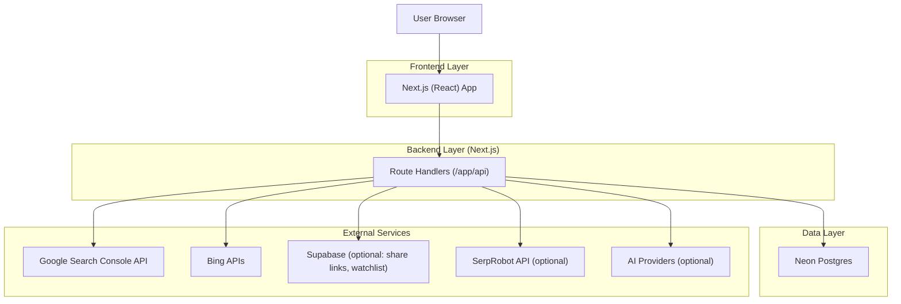
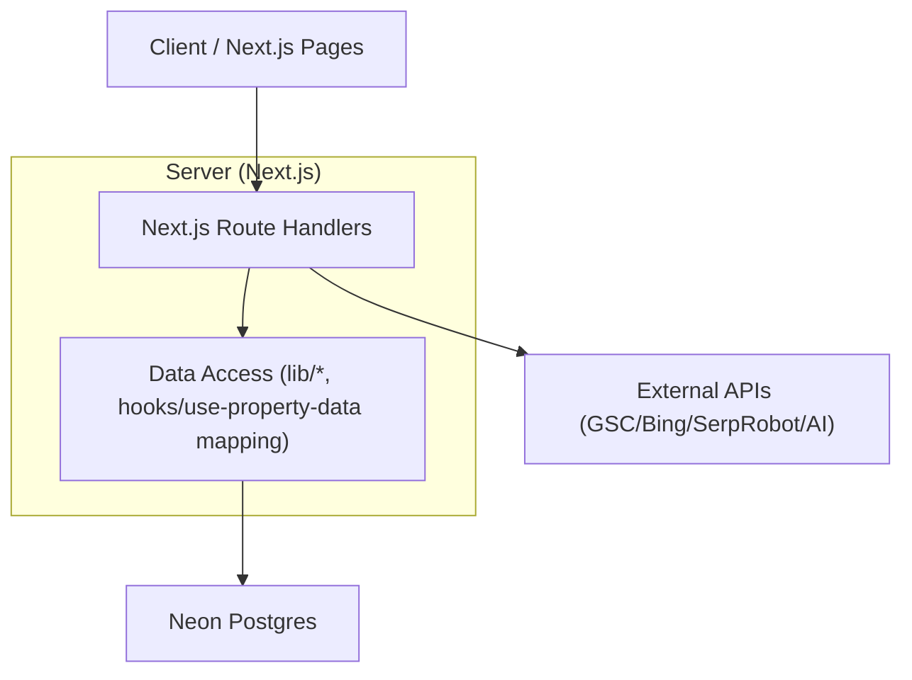

## 1.Architecture design


## 2.Technology Description
- Frontend: Next.js@14 (React@18) + tailwindcss@3 + recharts@3
- Backend: Next.js Route Handlers (App Router)
- Database: Neon Postgres (serverless driver)
- Data fetching/caching: @tanstack/react-query

## 3.Route definitions
| Route | Purpose |
|-------|---------|
| / | Overview (All Sites) dashboard with site cards and sparklines |
| /sites/[propertyId] | Project View (Site Detail) with simplified section layout |
| /login | Login page |
| /settings | Connections/settings (e.g., engines, tokens) |
| /s/[token] | Optional shared read-only view |

## 4.API definitions (If it includes backend services)
### 4.1 Core API (Project View)
```ts
// Shared concepts used by the Project View UI
export type Summary = {
  clicks: number;
  impressions: number;
  ctr: number;
  position: number;
  clicksChangePercent?: number;
  positionChangePercent?: number;
  queryCountChangePercent?: number;
};

export type DailyRow = {
  date: string; // YYYY-MM-DD
  clicks: number;
  impressions: number;
  ctr?: number;
  position?: number;
};

export type ChartAnnotation = {
  id?: string;
  date: string; // YYYY-MM-DD
  label: string;
  color?: string;
};
```

Representative endpoints used by Project View:
- GET /api/properties/[propertyId]/overview
- GET /api/properties/[propertyId]/detail
- GET /api/properties/[propertyId]/queries
- GET /api/properties/[propertyId]/pages
- GET /api/properties/[propertyId]/tracked-keywords
- GET /api/properties/[propertyId]/cannibalisation
- GET /api/properties/[propertyId]/annotations
- POST /api/properties/[propertyId]/annotations

## 5.Server architecture diagram (If it includes backend services)


## 6.Data model(if applicable)
### 6.1 Data model definition
No database schema changes are required for this refactor (layout + chart styling only).

Key existing entities involved:
- properties (site definitions)
- gsc aggregates/raw (time-series and table data)
- chart_annotations (used by Performance chart annotations)
- dashboard cache tables (used for faster reads)
