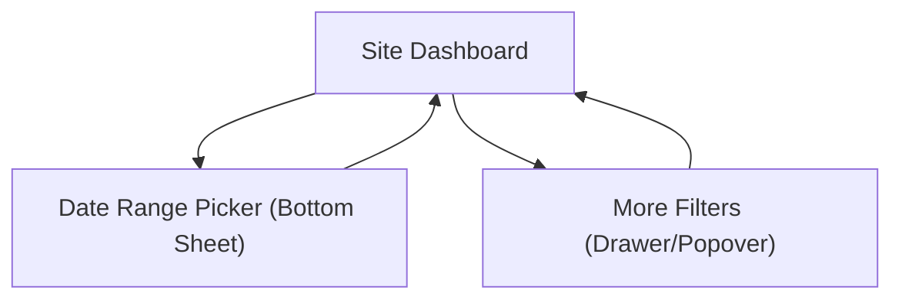

## 1. Product Overview
Fix two UX issues on the site dashboard: (1) card charts clipping in height, and (2) mobile header controls wrapping to multiple lines.
The goal is stable chart rendering and a one-line mobile control bar with fast access to date range + key toggles.

## 2. Core Features

### 2.1 User Roles
Not role-specific (same UI for all signed-in users).

### 2.2 Feature Module
1. **Site Dashboard**: mobile header control bar (date range + primary toggles), card charts with non-clipping responsive sizing.

### 2.3 Page Details
| Page Name | Module Name | Feature description |
|-----------|-------------|---------------------|
| Site Dashboard | Mobile header controls (one-line) | Show current date range as a compact button; open date picker on tap; display primary toggles inline for one-tap switching; keep all controls on a single row on small screens. |
| Site Dashboard | Mobile overflow behavior | Collapse secondary controls into a “More” menu/drawer while keeping date range + primary toggles always visible; preserve current selections when opening/closing. |
| Site Dashboard | Chart container sizing | Prevent chart canvas/SVG from being visually clipped; size charts based on container width with defined min-height; reflow on viewport changes and dynamic content changes. |
| Site Dashboard | Cross-breakpoint consistency | Keep desktop layout unchanged; ensure mobile controls do not push content down unexpectedly; maintain readable labels and tappable hit targets. |

## 3. Core Process
- Dashboard viewing flow: You open the dashboard and immediately see the current date range and key toggles in the header.
- Date range change flow (mobile): You tap the date range pill, select a new range, apply, and the dashboard refreshes while preserving toggle selections.
- Toggle flow (mobile): You tap a primary toggle (single tap) and the dashboard updates without layout jumps.
- Chart rendering flow: As data loads or viewport changes, charts resize to their container and never clip.

