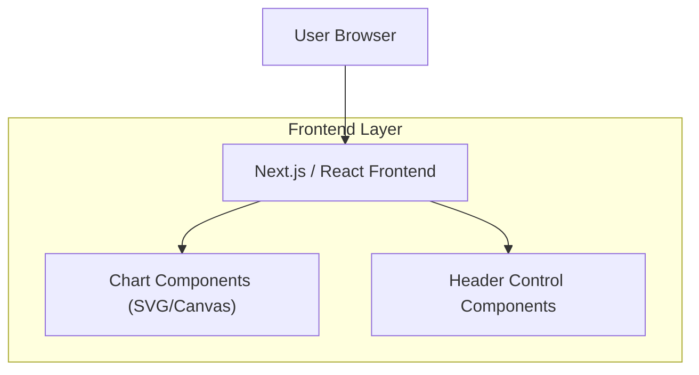

## 1.Architecture design

## 2.Technology Description
- Frontend: React (Next.js App Router) + Tailwind CSS
- Backend: None (for this change)

## 3.Route definitions
| Route | Purpose |
|-------|---------|
| /sites/[propertyId] | Site dashboard view where header controls and charts render |

## 4.API definitions (If it includes backend services)
N/A

## 5.Server architecture diagram (If it includes backend services)
N/A

## 6.Data model(if applicable)
N/A
